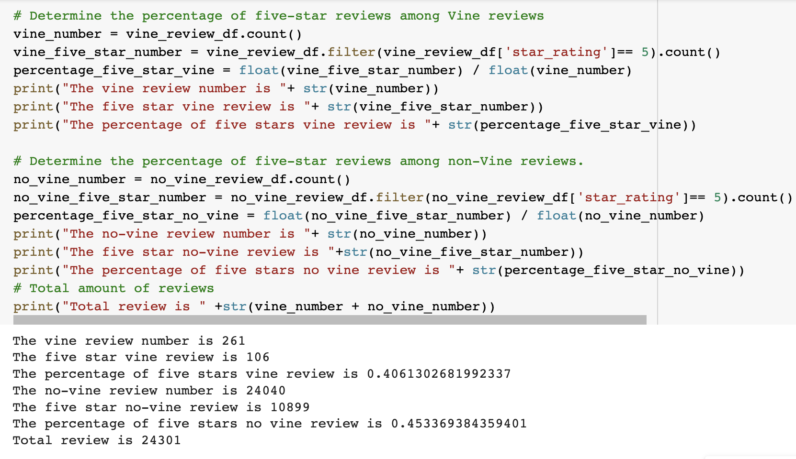

# Amazon_Vine_Analysis
Data source from "https://s3.amazonaws.com/amazon-reviews-pds/tsv/amazon_reviews_us_Home_Entertainment_v1_00.tsv.gz"

## Overview of the analysis
This analysis indicates members who paid the Amazon Vine program's written review. Next, organize the data process, including using PySpark to perform the ETL process to extract the dataset, transform the data, connect to an AWS RDS instance, and load the transformed data into pgAdmin. 

### Results

### Summary: In your summary, state if there is any positivity bias for reviews in the Vine program. Use the results of your analysis to support your statement. Then, provide one additional analysis that you could do with the dataset to support your statement.

There seems to be some positive bias towards reviews in the Vine program, as 40.6% of reviews were rated five stars contrasted to 45.3% of non-Vine reviews; however, the vine has a tiny number which has 106 to compare with 10899 non-vine reviews. To reach death analysis, we can process a t-test to check whether a statistical difference exists between these two samples.
